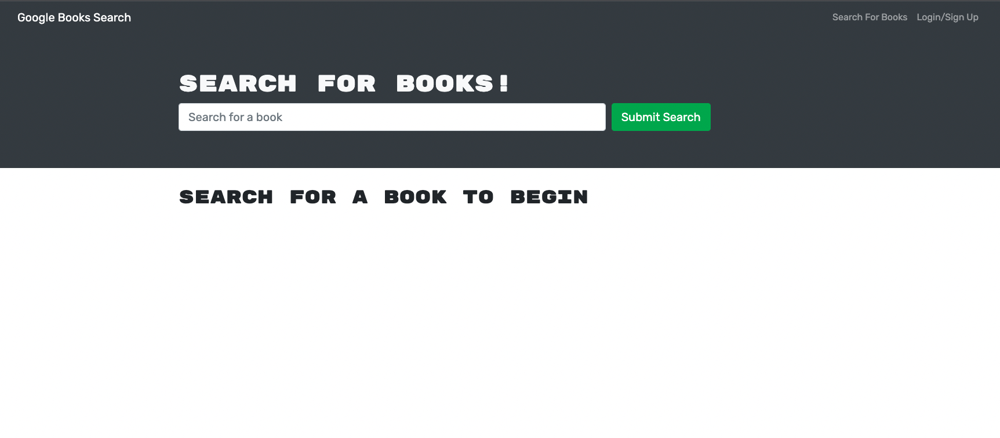

# boogle

## Description

It's google.... for books! 

## Technologies used

Javascript, React, MongoDB, Mongoose, GraphQL, Express.js, Node.js, Google Books API

## Instructions

Visit the Heroku App for a ready to use version of the app. Alternatively, clone the repo onto your machine and run 'npm i' then 'npm run develop' to launch the app.

## Preview 

## Links

[Link to deployed App via Heroku](https://frozen-brushlands-60270.herokuapp.com/)

[Link to Github Repo](https://github.com/puppetup/boogle)
